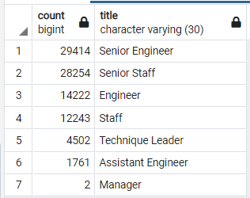
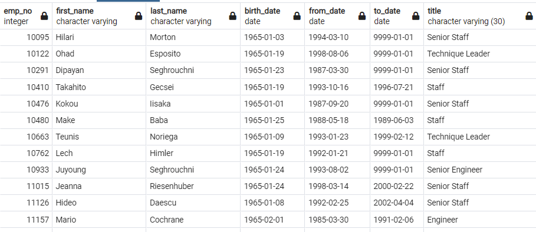

# Pewlett-Hackard-Analysis

## Overview

The purpose of the project is to determine the number of retiring employees per tittle and identify employees that are eligible to participate in a mentorship program. All of this using SQL queries. For this proyect we will create two tables, in one table we included data such as employee number, first and last name, position title, and start end date. In the other table we included employee number, first and last name, birth date, start and end date, and position title.

## Results

Table that determines the number of retiring employees and their role titles.

Table that shows the employees that are eligible for mentorship program.

### We can see that there are three important things that we can notice. 

1.- The majority of the retirees are senior engineers and senior staff.
2.- Senior Engineer and Senior Staff positions have the greatest priority when it comes to deciding which roles the company would like to fill.
3.- There are more people retiring than mentors, which means that the company will have to make an efficient program that cover the discrepancy between the number of people retiring and the number of people who could be trained to fill these positions.

